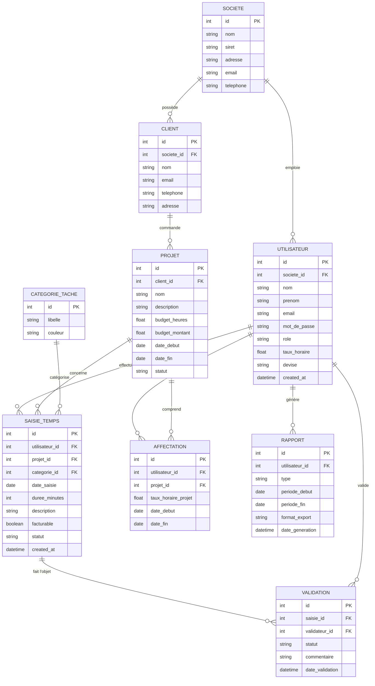

# 🕐 Timesheet App — Gestion des temps

**⚠️ Ce projet est un exercice personnel / pédagogique**  
Il sert à mettre en pratique Symfony, Clean Architecture, Docker, Merise/MCD, gestion des temps, etc.  
Il n'est **pas** destiné à une utilisation en production sans adaptations importantes (sécurité, tests exhaustifs, etc.).

> Application de suivi des temps pour sociétés, indépendants et freelances

## Contribuer au projet

Merci de votre intérêt pour cet exercice ! Voici les étapes recommandées pour commencer à contribuer ou simplement le faire tourner en local :

1. **Fork le projet**

   Cliquez sur le bouton **Fork** en haut à droite de cette page pour créer votre propre copie du dépôt.

2. **Cloner votre fork en local**

   ```bash

   git clone https://github.com/VOTRE_USERNAME/timesheet-app.git
   cd timesheet-app
   
   git remote add upstream https://github.com/ANDRILALAINA97/timesheet-app.git
   git fetch upstream

   # Démarrer tous les services (PHP + MySQL + Redis + phpMyAdmin)
docker compose up -d --build

# Installer les dépendances PHP (première fois)
 composer install

# Générer et appliquer les migrations Doctrine
docker compose exec php php bin/console make:migration   # optionnel si déjà généré

docker compose exec php php bin/console doctrine:migrations:migrate --no-interaction

# 🕐 Timesheet App — Modèle Conceptuel de Données (MCD)

> Modèle Merise de l'application de gestion des temps — Société / Indépendant

---

<!-- ## 📐 MCD — Diagramme Entité-Association



---

## 🗂️ Description des entités

### `SOCIETE`
Représente la structure employeuse (entreprise ou organisation).

| Attribut | Type | Description |
|---|---|---|
| `id` | int (PK) | Identifiant unique |
| `nom` | string | Raison sociale |
| `siret` | string | Numéro SIRET |
| `adresse` | string | Adresse postale |
| `email` | string | Email de contact |
| `telephone` | string | Téléphone |

---

### `UTILISATEUR`
Toute personne ayant accès à l'application (admin, collaborateur, freelance).

| Attribut | Type | Description |
|---|---|---|
| `id` | int (PK) | Identifiant unique |
| `societe_id` | int (FK) | Référence à `SOCIETE` |
| `nom` | string | Nom de famille |
| `prenom` | string | Prénom |
| `email` | string | Adresse email (login) |
| `mot_de_passe` | string | Hash bcrypt |
| `role` | string | `admin` / `collaborateur` / `freelance` |
| `taux_horaire` | float | Taux horaire par défaut |
| `devise` | string | EUR, USD, etc. |
| `created_at` | datetime | Date de création du compte |

---

### `CLIENT`
Client externe à facturer, rattaché à une société.

| Attribut | Type | Description |
|---|---|---|
| `id` | int (PK) | Identifiant unique |
| `societe_id` | int (FK) | Référence à `SOCIETE` |
| `nom` | string | Nom ou raison sociale |
| `email` | string | Email principal |
| `telephone` | string | Téléphone |
| `adresse` | string | Adresse postale |

---

### `PROJET`
Projet de travail associé à un client, avec suivi budgétaire.

| Attribut | Type | Description |
|---|---|---|
| `id` | int (PK) | Identifiant unique |
| `client_id` | int (FK) | Référence à `CLIENT` |
| `nom` | string | Intitulé du projet |
| `description` | string | Description détaillée |
| `budget_heures` | float | Budget en heures |
| `budget_montant` | float | Budget financier |
| `date_debut` | date | Date de démarrage |
| `date_fin` | date | Date de fin prévue |
| `statut` | string | `actif` / `en_pause` / `terminé` / `archivé` |

---

### `CATEGORIE_TACHE`
Référentiel des types de tâches (développement, réunion, conseil…).

| Attribut | Type | Description |
|---|---|---|
| `id` | int (PK) | Identifiant unique |
| `libelle` | string | Nom de la catégorie |
| `couleur` | string | Code couleur hex (#RRGGBB) |

---

### `SAISIE_TEMPS`
Entité centrale — enregistre chaque saisie d'heures effectuée par un utilisateur.

| Attribut | Type | Description |
|---|---|---|
| `id` | int (PK) | Identifiant unique |
| `utilisateur_id` | int (FK) | Référence à `UTILISATEUR` |
| `projet_id` | int (FK) | Référence à `PROJET` |
| `categorie_id` | int (FK) | Référence à `CATEGORIE_TACHE` |
| `date_saisie` | date | Date de la prestation |
| `duree_minutes` | int | Durée en minutes |
| `description` | string | Détail de la tâche réalisée |
| `facturable` | boolean | Inclus dans la facturation ? |
| `statut` | string | `brouillon` / `soumis` / `validé` / `refusé` |
| `created_at` | datetime | Date de création |

---

### `AFFECTATION`
Relation many-to-many entre utilisateurs et projets, avec taux horaire spécifique.

| Attribut | Type | Description |
|---|---|---|
| `id` | int (PK) | Identifiant unique |
| `utilisateur_id` | int (FK) | Référence à `UTILISATEUR` |
| `projet_id` | int (FK) | Référence à `PROJET` |
| `taux_horaire_projet` | float | Taux horaire pour ce projet |
| `date_debut` | date | Début de l'affectation |
| `date_fin` | date | Fin de l'affectation |

---

### `VALIDATION`
Workflow de validation des saisies par un administrateur.

| Attribut | Type | Description |
|---|---|---|
| `id` | int (PK) | Identifiant unique |
| `saisie_id` | int (FK) | Référence à `SAISIE_TEMPS` |
| `validateur_id` | int (FK) | Référence à `UTILISATEUR` (admin) |
| `statut` | string | `approuvé` / `refusé` |
| `commentaire` | string | Motif de refus ou remarque |
| `date_validation` | datetime | Horodatage de la décision |

---

### `RAPPORT`
Trace les exports et rapports générés par les utilisateurs.

| Attribut | Type | Description |
|---|---|---|
| `id` | int (PK) | Identifiant unique |
| `utilisateur_id` | int (FK) | Référence à `UTILISATEUR` |
| `type` | string | `mensuel` / `projet` / `client` / `facturation` |
| `periode_debut` | date | Début de la période analysée |
| `periode_fin` | date | Fin de la période analysée |
| `format_export` | string | `PDF` / `CSV` / `Excel` |
| `date_generation` | datetime | Horodatage de l'export |

---

## 🔗 Cardinalités

| Relation | Type | Description |
|---|---|---|
| `SOCIETE` → `UTILISATEUR` | 1,N | Une société emploie plusieurs utilisateurs |
| `SOCIETE` → `CLIENT` | 1,N | Une société possède plusieurs clients |
| `CLIENT` → `PROJET` | 1,N | Un client commande plusieurs projets |
| `UTILISATEUR` → `SAISIE_TEMPS` | 1,N | Un utilisateur effectue plusieurs saisies |
| `PROJET` → `SAISIE_TEMPS` | 1,N | Un projet regroupe plusieurs saisies |
| `CATEGORIE_TACHE` → `SAISIE_TEMPS` | 1,N | Une catégorie classifie plusieurs saisies |
| `UTILISATEUR` ↔ `PROJET` | N,N | Via `AFFECTATION` (avec taux horaire propre) |
| `SAISIE_TEMPS` → `VALIDATION` | 1,N | Une saisie peut avoir un historique de validations |
| `UTILISATEUR` → `RAPPORT` | 1,N | Un utilisateur génère plusieurs rapports |

---

## 🏗️ Architecture logique (couches)

```
┌─────────────────────────────────────┐
│         COUCHE ORGANISATION         │
│         SOCIETE · UTILISATEUR       │
└──────────────┬──────────────────────┘
               │
┌──────────────▼──────────────────────┐
│         COUCHE PROJET / CLIENT      │
│    CLIENT · PROJET · AFFECTATION    │
└──────────────┬──────────────────────┘
               │
┌──────────────▼──────────────────────┐
│           COUCHE SAISIE             │
│  SAISIE_TEMPS · CATEGORIE_TACHE     │
│      VALIDATION · RAPPORT           │
└─────────────────────────────────────┘
``` -->

---

> **Version** : 1.0 — Mars 2026  
> **Méthode** : Merise — MCD (Modèle Conceptuel de Données)  
> **Lié au** : Cahier des Charges Application Timesheet v1.0