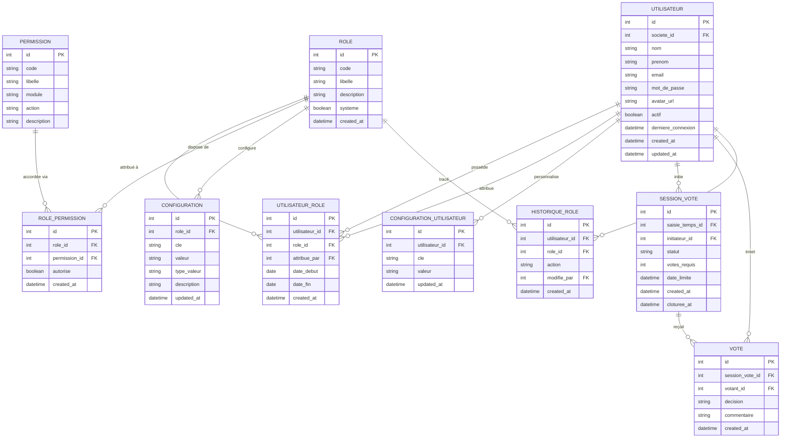

#  PROJET PRATIQUE CLEAN ARCHI,DOCKER,FRANKEN PHP
# 👤 Timesheet App — MCD : Utilisateurs, Rôles & Vote

> Modèle Merise détaillé pour la gestion des utilisateurs, des rôles avec configuration fine et le système de vote de validation.

---

## 📐 MCD — Diagramme Entité-Association



---

## 🏗️ Architecture logique (3 modules)

```
┌──────────────────────────────────────────────────────┐
│              MODULE UTILISATEUR                      │
│          UTILISATEUR · HISTORIQUE_ROLE               │
└─────────────────────┬────────────────────────────────┘
                      │
┌─────────────────────▼────────────────────────────────┐
│              MODULE RÔLES & PERMISSIONS              │
│   ROLE · UTILISATEUR_ROLE · PERMISSION               │
│   ROLE_PERMISSION · CONFIGURATION                    │
│   CONFIGURATION_UTILISATEUR                          │
└─────────────────────┬────────────────────────────────┘
                      │
┌─────────────────────▼────────────────────────────────┐
│              MODULE VOTE                             │
│          SESSION_VOTE · VOTE                         │
└──────────────────────────────────────────────────────┘
```

---

## 🗂️ Description des entités

### `UTILISATEUR`
Compte d'accès à l'application — commun à tous les profils.

| Attribut | Type | Contrainte | Description |
|---|---|---|---|
| `id` | int | PK | Identifiant unique |
| `societe_id` | int | FK | Référence à `SOCIETE` |
| `nom` | string | NOT NULL | Nom de famille |
| `prenom` | string | NOT NULL | Prénom |
| `email` | string | UNIQUE, NOT NULL | Adresse email (login) |
| `mot_de_passe` | string | NOT NULL | Hash bcrypt |
| `avatar_url` | string | nullable | URL de la photo de profil |
| `actif` | boolean | DEFAULT true | Compte activé ou suspendu |
| `derniere_connexion` | datetime | nullable | Horodatage dernière session |
| `created_at` | datetime | NOT NULL | Date de création |
| `updated_at` | datetime | NOT NULL | Dernière mise à jour |

---

### `ROLE`
Définit un profil fonctionnel attribuable à un utilisateur.

| Attribut | Type | Contrainte | Description |
|---|---|---|---|
| `id` | int | PK | Identifiant unique |
| `code` | string | UNIQUE, NOT NULL | Identifiant technique (`admin`, `collaborateur`, `freelance`, `manager`) |
| `libelle` | string | NOT NULL | Nom affiché |
| `description` | string | nullable | Description du rôle |
| `systeme` | boolean | DEFAULT false | Rôle système non supprimable |
| `created_at` | datetime | NOT NULL | Date de création |

**Rôles système prédéfinis :**

| Code | Libellé | Accès |
|---|---|---|
| `admin` | Administrateur | Accès total, gestion des utilisateurs |
| `manager` | Responsable | Validation des saisies, rapports équipe |
| `collaborateur` | Collaborateur | Saisie des temps sur projets affectés |
| `freelance` | Indépendant | Saisie multi-clients, facturation |

---

### `UTILISATEUR_ROLE`
Table d'association many-to-many entre utilisateurs et rôles, avec traçabilité.

| Attribut | Type | Contrainte | Description |
|---|---|---|---|
| `id` | int | PK | Identifiant unique |
| `utilisateur_id` | int | FK NOT NULL | Référence à `UTILISATEUR` |
| `role_id` | int | FK NOT NULL | Référence à `ROLE` |
| `attribue_par` | int | FK NOT NULL | Référence à l'`UTILISATEUR` qui a attribué le rôle |
| `date_debut` | date | NOT NULL | Début de validité du rôle |
| `date_fin` | date | nullable | Fin de validité (null = permanent) |
| `created_at` | datetime | NOT NULL | Date d'attribution |

> Un utilisateur peut avoir plusieurs rôles simultanément. Les droits effectifs sont l'union des permissions de tous ses rôles actifs.

---

### `PERMISSION`
Granule d'autorisation atomique, organisée par module et action.

| Attribut | Type | Contrainte | Description |
|---|---|---|---|
| `id` | int | PK | Identifiant unique |
| `code` | string | UNIQUE, NOT NULL | Identifiant technique (`saisie.create`, `projet.delete`…) |
| `libelle` | string | NOT NULL | Nom affiché |
| `module` | string | NOT NULL | Domaine fonctionnel (`saisie`, `projet`, `client`, `rapport`, `admin`) |
| `action` | string | NOT NULL | Opération (`create`, `read`, `update`, `delete`, `export`, `validate`) |
| `description` | string | nullable | Explication de la permission |

**Exemples de permissions :**

| Code | Module | Action |
|---|---|---|
| `saisie.create` | saisie | create |
| `saisie.validate` | saisie | validate |
| `projet.manage` | projet | update |
| `rapport.export` | rapport | export |
| `admin.users` | admin | update |

---

### `ROLE_PERMISSION`
Matrice d'autorisation : quelles permissions sont accordées à quel rôle.

| Attribut | Type | Contrainte | Description |
|---|---|---|---|
| `id` | int | PK | Identifiant unique |
| `role_id` | int | FK NOT NULL | Référence à `ROLE` |
| `permission_id` | int | FK NOT NULL | Référence à `PERMISSION` |
| `autorise` | boolean | DEFAULT true | Autorisé (`true`) ou explicitement refusé (`false`) |
| `created_at` | datetime | NOT NULL | Date de configuration |

---

### `CONFIGURATION`
Paramètres comportementaux associés à un rôle (règles métier configurables).

| Attribut | Type | Contrainte | Description |
|---|---|---|---|
| `id` | int | PK | Identifiant unique |
| `role_id` | int | FK NOT NULL | Référence à `ROLE` |
| `cle` | string | NOT NULL | Identifiant du paramètre |
| `valeur` | string | NOT NULL | Valeur du paramètre (sérialisée) |
| `type_valeur` | string | NOT NULL | `boolean`, `integer`, `string`, `json` |
| `description` | string | nullable | Explication du paramètre |
| `updated_at` | datetime | NOT NULL | Dernière mise à jour |

**Exemples de configurations par rôle :**

| Rôle | Clé | Valeur | Description |
|---|---|---|---|
| `manager` | `validation.mode` | `vote` | Mode de validation : unitaire ou vote |
| `manager` | `vote.quorum` | `2` | Nombre de votes requis |
| `collaborateur` | `saisie.rappel_quotidien` | `true` | Notification de saisie |
| `freelance` | `facturation.auto` | `true` | Génération auto des factures |
| `admin` | `session.duree_max` | `480` | Durée max de session (minutes) |

---

### `CONFIGURATION_UTILISATEUR`
Préférences personnelles de l'utilisateur, surchargeant la config du rôle.

| Attribut | Type | Contrainte | Description |
|---|---|---|---|
| `id` | int | PK | Identifiant unique |
| `utilisateur_id` | int | FK NOT NULL | Référence à `UTILISATEUR` |
| `cle` | string | NOT NULL | Identifiant du paramètre |
| `valeur` | string | NOT NULL | Valeur personnalisée |
| `updated_at` | datetime | NOT NULL | Dernière mise à jour |

**Exemples :**

| Clé | Valeur | Description |
|---|---|---|
| `theme` | `dark` | Thème de l'interface |
| `langue` | `fr` | Langue de l'application |
| `notifications.email` | `true` | Recevoir les notifications par email |
| `vue_defaut` | `semaine` | Vue du timesheet par défaut |

---

## 🗳️ Système de Vote

### `SESSION_VOTE`
Représente une session de vote ouverte sur une saisie de temps.

| Attribut | Type | Contrainte | Description |
|---|---|---|---|
| `id` | int | PK | Identifiant unique |
| `saisie_temps_id` | int | FK NOT NULL | Référence à `SAISIE_TEMPS` soumise au vote |
| `initiateur_id` | int | FK NOT NULL | Référence à l'`UTILISATEUR` qui ouvre le vote |
| `statut` | string | NOT NULL | `ouverte` / `cloturee` / `expiree` |
| `votes_requis` | int | DEFAULT 2 | Quorum nécessaire pour clôturer |
| `date_limite` | datetime | nullable | Expiration automatique |
| `created_at` | datetime | NOT NULL | Date d'ouverture |
| `cloturee_at` | datetime | nullable | Date de clôture effective |

**Règle de clôture :**
- La session se clôture automatiquement quand `votes_requis` votes `approuvé` **ou** `refusé` ont été atteints.
- Au-delà de `date_limite`, la session passe en `expiree` et la saisie retourne en `brouillon`.

---

### `VOTE`
Vote individuel émis par un utilisateur habilité dans une session.

| Attribut | Type | Contrainte | Description |
|---|---|---|---|
| `id` | int | PK | Identifiant unique |
| `session_vote_id` | int | FK NOT NULL | Référence à `SESSION_VOTE` |
| `votant_id` | int | FK NOT NULL | Référence à l'`UTILISATEUR` votant |
| `decision` | string | NOT NULL | `approuve` / `refuse` / `abstention` |
| `commentaire` | string | nullable | Justification ou remarque |
| `created_at` | datetime | NOT NULL | Horodatage du vote |

> **Contrainte d'unicité** : `(session_vote_id, votant_id)` — un utilisateur ne peut voter qu'une seule fois par session.

---

### `HISTORIQUE_ROLE`
Journal d'audit des attributions et retraits de rôles.

| Attribut | Type | Contrainte | Description |
|---|---|---|---|
| `id` | int | PK | Identifiant unique |
| `utilisateur_id` | int | FK NOT NULL | Utilisateur concerné |
| `role_id` | int | FK NOT NULL | Rôle concerné |
| `action` | string | NOT NULL | `attribue` / `retire` / `modifie` |
| `modifie_par` | int | FK NOT NULL | Administrateur ayant effectué l'action |
| `created_at` | datetime | NOT NULL | Horodatage de l'action |

---

## 🔗 Cardinalités complètes

| Relation | Cardinalité | Description |
|---|---|---|
| `UTILISATEUR` → `UTILISATEUR_ROLE` | 1,N | Un utilisateur peut avoir N rôles |
| `ROLE` → `UTILISATEUR_ROLE` | 1,N | Un rôle peut être attribué à N utilisateurs |
| `UTILISATEUR` → `UTILISATEUR_ROLE` (attribue) | 1,N | Un admin attribue N rôles |
| `ROLE` → `ROLE_PERMISSION` | 1,N | Un rôle dispose de N permissions |
| `PERMISSION` → `ROLE_PERMISSION` | 1,N | Une permission peut appartenir à N rôles |
| `ROLE` → `CONFIGURATION` | 1,N | Un rôle a N paramètres de configuration |
| `UTILISATEUR` → `CONFIGURATION_UTILISATEUR` | 1,N | Un utilisateur a N préférences personnelles |
| `UTILISATEUR` → `SESSION_VOTE` | 1,N | Un utilisateur initie N sessions de vote |
| `SESSION_VOTE` → `VOTE` | 1,N | Une session reçoit N votes |
| `UTILISATEUR` → `VOTE` | 1,N | Un utilisateur émet N votes (1 par session) |
| `UTILISATEUR` → `HISTORIQUE_ROLE` | 1,N | Historique lié à l'utilisateur concerné |
| `ROLE` → `HISTORIQUE_ROLE` | 1,N | Historique des modifications d'un rôle |

---

## 🔐 Matrice des permissions par rôle (exemple)

| Permission | Admin | Manager | Collaborateur | Freelance |
|---|:---:|:---:|:---:|:---:|
| `saisie.create` | ✅ | ✅ | ✅ | ✅ |
| `saisie.validate` | ✅ | ✅ | ❌ | ❌ |
| `saisie.vote` | ✅ | ✅ | ❌ | ❌ |
| `projet.manage` | ✅ | ✅ | ❌ | ✅ |
| `client.manage` | ✅ | ✅ | ❌ | ✅ |
| `rapport.export` | ✅ | ✅ | ✅ | ✅ |
| `admin.users` | ✅ | ❌ | ❌ | ❌ |
| `admin.roles` | ✅ | ❌ | ❌ | ❌ |
| `facturation.generate` | ✅ | ✅ | ❌ | ✅ |

---

## 🗳️ Workflow du système de vote

```
Saisie soumise
     │
     ▼
SESSION_VOTE créée (statut: ouverte)
     │
     ├──► Utilisateur A vote (approuve/refuse)
     ├──► Utilisateur B vote (approuve/refuse)
     │         ...
     ▼
Quorum atteint ?
     │
     ├─── OUI ──► SESSION_VOTE cloturée
     │                 │
     │                 ├─ Majorité approuve ──► SAISIE_TEMPS statut: validé
     │                 └─ Majorité refuse   ──► SAISIE_TEMPS statut: refusé
     │
     └─── NON + date_limite dépassée ──► SESSION_VOTE expirée
                                              │
                                              └──► SAISIE_TEMPS retour: brouillon
```

---

> **Version** : 1.0 — Mars 2026
> **Méthode** : Merise — MCD (Modèle Conceptuel de Données)
> **Module** : Utilisateurs · Rôles · Configuration · Vote
> **Lié au** : Cahier des Charges Application Timesheet v1.0